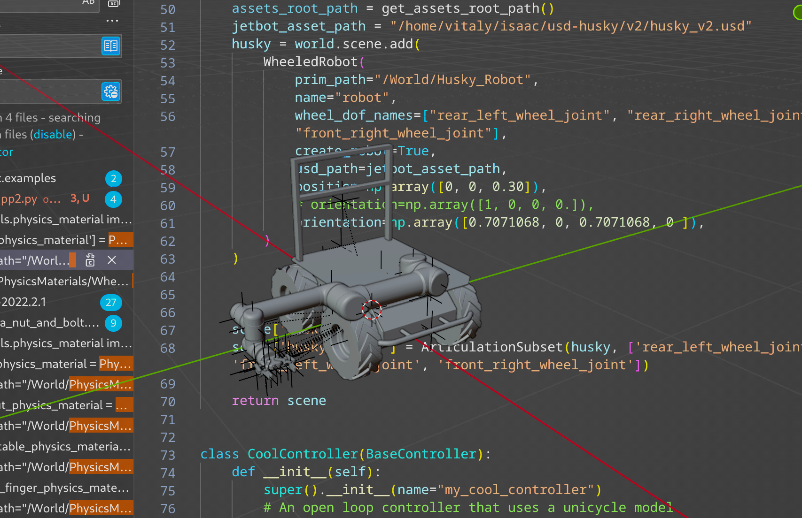

# virtual-husky

Данный репозиторий посвящен реализации виртуального Husky в симуляторе
[Isaac Sim](https://docs.omniverse.nvidia.com/isaacsim/latest/index.html), а также запуска различных сценариев
и записи синтетических датасетов на их основе.



## Table of Contents

- [Table of Contents](#table-of-contents)
- [Pre-requisites or Dependencies](#pre-requisites-or-dependencies)
  - [Isaac Sim Installation](#isaac-sim-installation)
  - [ROS Installation](#ros-installation)
  - [DVC Installation and Setup](#dvc-installation-and-setup)
- [Structure](#structure)
- [Quickstart](#quickstart)
- [Pre-setup for Scenarios](#pre-setup-for-scenarios)
  - [LiDAR for Husky](#lidar-for-husky)
  - [MIPT env](#mipt-env)
- [Usage patterns](#usage-patterns)
  - [Super Plain Demo](#super-plain-demo)
  - [Pre-setted cases](#pre-setted-cases)
    - [Offline pipeline](#offline-pipeline)
    - [Online pipeline](#online-pipeline)
  - [Simple customization](#simple-customization)
  - [Advanced customization](#advanced-customization)
- [Работа с ROS](#работа-с-ros)
  - [Работа с ROS1](#работа-с-ros1)
    - [Offline mode](#offline-mode)
    - [Online mode](#online-mode)
  - [Работа с ROS2](#работа-с-ros2)
- [Configuration](#configuration)
  - [Configuration files](#configuration-files)
  - [Own config files](#own-config-files)
  - [Command line arguments](#command-line-arguments)
- [Data (and dvc)](#data-and-dvc)
  - [3D модель робота](#3d-модель-робота)
  - [3D модель среды](#3d-модель-среды)
  - [DVC 'на пальцах'](#dvc-на-пальцах)
  - [Работа с DVC](#работа-с-dvc)
- [Code quality and CI](#code-quality-and-ci)
  - [Code quality](#code-quality)
  - [CI](#ci)
- [Known issues](#known-issues)
- [TODO](#todo)

## Pre-requisites or Dependencies

- [Isaac Sim](https://docs.omniverse.nvidia.com/isaacsim/latest/install_workstation.html)
- [ROS2-Humble](https://docs.ros.org/en/humble/Installation.html)
- **или** [ROS-Noetic](https://wiki.ros.org/noetic/Installation)
- [DVC](https://dvc.org/doc/install)

### Isaac Sim Installation

На данный момент предполагается работа с desktop-версией симулятора, работа в докер контейнере и без
графического интерфейса также поддерживается, но будет добавлена позже.

В целом, [официальная инструкция](https://docs.omniverse.nvidia.com/isaacsim/latest/install_workstation.html)
содержит довольно детальное описание всех шагов установки, которым нужно внимательно следовать и не пропускать
"лишние шаги" если не уверены что они действительно лишние. Здесь приведены только некоторые замечания к этой
инструкции.

**Notes:**

- Системные требования
  - Системные требования указанные в п.1 инструкции являются скорее рекомендациями, симулятор успешно (хоть и
    более медленно) работает и на менее мощном железе.
  - Если у вас меньше оперативной памяти чем "минимально необходимо", рекомендуется увеличить размер файла
    подкачки (swap file) до соответствия требованиям или чуть больше (например у вас 16 Gb RAM, минимальное
    требование 32 Gb RAM -
    [создать swap file](https://www.digitalocean.com/community/tutorials/how-to-add-swap-space-on-ubuntu-20-04)
    16+ Gb).
  - **Критичное требование** к видеокарте - она должна поддерживать технологию RTX.
- Регистрация и установка
  - Для регистрации как nvidia developer лучше использовать почту в домене gmail.com (есть подозрение, что с
    российскими адресами не работает принципиально)
  - Для скачивания и установки Isaac Sim потребуется VPN, желательно платный тк объем данных большой. Далее
    при использовании через python API VPN не нужен, но при использовании GUI симулятор с завидной
    регулярностью просит авторизоваться на сайте Nvidia, что опять таки требует VPN.
  - П. 6 инструкции по установке VSCode - разумеется, не является обязательным. Это может быть удобно, так как
    многие утилиты содержат специальную кнопку для "открыть код в VSCode" и даже поддерживается отладка, но на
    практике если ваш компьютер не соответствует "оптимальным" требованиям, то такой функционал будет работать
    очень медленно.

### ROS Installation

Конкретные версии (Noetic, Humble) - не принцпипиальны, но а) Это последние под-версии соответствующих версий
ROS; б) С ними точно работает, с другими не проверяли. Поэто рекомендуется использовать именно их.

Для установки - следуем официальной документации [ROS](https://wiki.ros.org/noetic/Installation) или
[ROS 2](https://docs.ros.org/en/humble/Installation.html).

**Notes:**

- ROS Noetic - официально не поддерживается для Ubuntu 22.04 (но если очень хочется, можно
  [собрать из исходников](https://www.reddit.com/r/ROS/comments/158icpy/compiling_ros1_noetic_from_source_on_ubuntu_2204/)
  и что-то даже будет работать, но не все пакеты доступны и тд и тп)

- ROS 2 Humble - существует только в beta-версии для Ubuntu 20.04, его тоже можно
  [собрать из исходников](https://docs.ros.org/en/humble/Installation/Alternatives/Ubuntu-Development-Setup.html),
  но не проверяли.

- В связи с этим, если если у вас Ubuntu 20.04 - возможно, проще использовать ROS1 или ROS2 через
  Docker-контейнер.

- То же самое но в обратную сторону для Ubuntu 22.04 - лучше использовать ROS2, или ROS1 через
  Docker-контейнер.

- Также **(только для ROS2)** для корректной работы публикации топиков (точнее интерфейса, который её
  обеспечивает), нужен специальный конфиг. Это конфиг лежит в
  [/config/ros2/fastdds.xml](/config/ros2/fastdds.xml).

```bash
# копируем конфиг в директорию ROS
cp config/ros2/fastdds.xml ~/.ros/

```

### DVC Installation and Setup

DVC - это инструмент для управления данными, который позволяет хранить данные в удаленном хранилище (в данном
случае - S3-совместимом удалённом хранилище), версионировать их и работать с ними как с локальными. **По
сути - "git for data".** Подробнее о том, зачем это нужно и как работать с DVC можно прочитать в разделе
[Data (and dvc)](#data-and-dvc).

С установкой dvc всё просто - установка согласно инструкции на
[официальном сайте](https://dvc.org/doc/install), а для работы с удаленным хранилищем необходимо установить
следующие переменные среды:

```bash
export AWS_SECRET_ACCESS_KEY=jyk6lgkvhwuemj752vawtcnvw2afz2pwac6skzhsrcs3rfxvbgpru
export AWS_ACCESS_KEY_ID=jvn4b7kof64vmlbur7i3ahx6wblq
```

(Да это секретные ключи, но хранилище бесплатное, репозиторий приватный и надеюсь все будет хорошо, если есть
конструктивные предложения по улучшению - буду рад услышать и поправить).

Как работать с DVC описано в разделе [Data (and dvc)](#data-and-dvc), но чтение
[официального гайда](https://dvc.org/doc/start/data-and-model-versioning) также приветствуется.

**Note:** Если вы устанавливаете dvc через pip, то для работы с S3 потребуется дополнительный пакет `dvc-s3`:

```bash
pip install dvc-s3
```

## Structure

Структура репозитория:

```bash
virtual-husky
├── assets
│   ├── husky
│   │   ├── ####.usd
│   └── objects
│       ├── chair
│       │   ├── ####.usd
│       │   ├── chair.dae
│       │   ├── chair.stl
│       │   ├── ####.urdf
│       │   └── Image.002.jpg
│       ├── cup
│       │   ├── cup.stl
│       │   ├── ####.urdf
│       │   └── ####.usd
│       ├── table
│       │   ├── Image.003.jpg
│       │   ├── table.dae
│       │   ├── table.stl
│       │   └── ####.usd
│       ├── toy_cat
│       │   ├── Image.jpg
│       │   ├── toy_cat.dae
│       │   ├── toy_cat.stl
│       └── trash_can
│           └── ####.usd
├── assets.dvc
├── config
│   ├── general
│   │   ├── ####.yaml
│   │   ├── ####.yaml
│   │   └── README.md
│   ├── LiDAR
│   │   ├── ####.json
│   │   └── ####.json
│   ├── ros2
│   │   └── fastdds.xml
│   └── scenarios
│       ├── ####.yaml
│       └── ####.yaml
├── img
│   └── husky_code_u.png
├── navi_pick_main.py
├── README.md
├── ros
│   ├── ros_ws
│   │   └── src
│   │       ├── CMakeLists.txt -> /opt/ros/noetic/share/catkin/cmake/toplevel.cmake
│   │       └── communication_msgs
│   │           ├── action
│   │           │   ├── ####.action
│   │           │   └── ####.action
│   │           ├── CMakeLists.txt
│   │           ├── msg
│   │           │   ├── ####.msg
│   │           │   └── ####.msg
│   │           └── package.xml
│   └── setup_ros_noetic.sh
└── src
    ├── actions
    │   ├── action_servers.py
    │   ├── base_server.py
    │   ├── communication_msgs.py
    │   ├── controller.py
    │   └── scenario.py
    ├── config.py
    ├── controllers
    │   ├── __init__.py
    │   ├── interface_helper.py
    │   ├── kinematics.py
    │   ├── motion_policy_interface.py
    │   ├── pick_place_controller.py
    │   ├── pick_place.py
    │   └── rmpflow.py
    ├── rmpflow
    │   ├── ####.yaml
    │   ├── ####.urdf
    │   └── ####.usd
    ├── scene_setup
    │   ├── environment.py
    │   └── objects.py
    ├── sensors
    │   ├── cameras.py
    │   ├── imu.py
    │   ├── lidar.py
    │   └── tf.py
    └── tasks
        ├── follow_target.py
        ├── navigation.py
        └── pick_place.py
```

где:

- `assets` - директория, в которой хранятся различные 3D модели (или их составляющие), как правило в формате
  usd. Для экономии места используется бинарный формат usd, и эта директория версионируется с помощью dvc, а
  не git.

- `config` - директория с конфигурационными файлами пайплайна в целом и отдельных сенсоров, сценариев.

- `navi_pick_main.py` - единая точка входа, для запуска различных сценариев навигации и захвата цели.

- `src/{controllers,rmpflow,tasks}` - содержат базовые скрипты отвечающие за управление и кинематику робота,
  пока более детально только в документации.

- `src/actions` - сожержит верхнеуровневые скрипты, для запуска сценариев навигации и захвата цели. В том
  числе инициализацию класса-контроллера для робота в целом.

- `src/sensors` - содержит скрипты для настройки сенсоров и публикации данных в ROS2.

- `src/scene_setup` - содержит скрипты для настройки сцены (размещение объектов, подгрузка background среды и
  тд).

- `ros` - содержит скрипт для запуска ros1 в докер, а также пакет с сообщениями для Action Server -ов.

## Quickstart

Запустим тестовый сценарий навигации и захвата цели (в демо-среде, без сенсоров).

**Notes:**

- Для корректной работы скриптов (импорт модулей Isaac Sim и тд) - необходимо запускать их из директории
  расположенной где-либо внутри корневой директории симулятора (при установке по умолчанию -
  `/home/<USER>/.local/share/ov/pkg/isaac_sim-2022.2.1`).

В целом можно располагать скрипты прямо в ней, но разработчики предусмотрели отдельную директорию для хранения
пользовательских расширений (и скриптов соответственно) - `extension_examples/user_examples` и логично
использовать её. Или по крайней мере просто внутри директории `extension_examples`.

_SubNote:_ extension_examles - просто ссылка на директорию, которая лежит глубже, поэтому относительные пути
могут отличаться от просто `extension_examples/bla-blah`- это нормально.

- Скрипты запускаются не просто через `python`, a из корневой директории симулятора, через
  `./python.sh <path_to_script.py>`. Это необходимо для корректной работы импорта модулей Isaac Sim.

  - _Есть опция запуска внутри conda env просто командой python, но об этом позже_

- Для QuickStart не будем заморачиваться с ROS - просто запустим элементарный сценарий, без сенсоров и
публикации чего-либо в топики.
<!-- - Если у вас установлен ROS2/ROS его **не надо включать (source ...)** в терминале, который используется для
  запуска скриптов. Это приведет к конфликтам переменных среды.


- Для корректной работы с ROS(2) также необходимо настроить переменные среды, подробнее в разделе
  [Работа с ROS2](#работа-с-ros2). -->

```bash
# Переходим в корневую директорию симулятора и далее в `extension_examples`
# Не забываем заменить <USER> на свой логин
cd /home/<USER>/.local/share/ov/pkg/isaac_sim-2022.2.1/extension_examples

# Клонируем репозиторий
git clone https://git.sberrobots.ru/mipt.navigation/simulator/virtual-husky.git
# или если у вас есть ssh ключи
git clone git@git.sberrobots.ru:mipt.navigation/simulator/virtual-husky.git

# Переходим в директорию с репозиторием
cd virtual-husky

# Подтягиваем данные
dvc pull

# Выходим обратно в корневую директорию симулятора
cd ../..

# Запускаем скрипт
./python.sh extension_examples/virtual-husky/navi_pick_main.py

# Ждём пока скрипт загрузится и начнёт выполняться, это может занять время (до 5-7 минут)

# Робот появляется и едет поднимать синий кубик, это может у него не получиться - это нормально.
# Синих кубика сейчас 2 - один лишний, но откуда он там берется пока не понятно :)

# Для остановки скрипта нажимаем Ctrl+C
```

## Pre-setup for Scenarios

Для не QuickStart вариантов пайплайна, необходимо сделать некоторые приготовления.

### LiDAR for Husky

Актуальная модель робота уже включает в себя все необходимые сенсоры, включая лидар, но последний требует
отдельного конфига, который должен лежать в конкретной директории "внутри" симулятора:

```bash
cp config/LiDAR/VLP_16.json <path/to/isaac_root_dir>/isaac_sim-2022.2.1/exts/omni.sensors.nv.lidar/data/
```

### MIPT env

На данный момент используется бесплатная версия S3 хранилища, а файл среды весит ~$900$ Mb, и пока хранится на
яндекс диске.

Для запуска пайплайна в среде МФТИ - скачать [архив](https://disk.yandex.ru/d/5kbo5Linwc1fHw), распаковать и
разместить там, где будет удобно.

Внутри архив выглядит так:

```bash
mipt_env3
├── mipt_env_3f.usd
└── textures
    ├── chair.jpg
    ├── mipt_env_small_simple.png
    ├── table.jpg
    └── toy_cat.jpg
```

Путь нужно указывать к файлу `mipt_env_3f.usd`. Также его можно открыть просто в графическом интерфейсе
IsaacSim.

**Note:** usd файл **не** самодостаточный - пути к текстурам фотореалистичных объектов прописаны
относительные, поэтому очень рекомендуется перемещать только всю распакованную директорию целиком, чтобы
текстуры не терялись.

## Usage patterns

### Super Plain Demo

По сути - описан в [QuickStart](#quickstart) - сценарий без среды, просто робот подъезжает к кубику и пробует
поднять его.

### Pre-setted cases

#### Offline pipeline

Это один из 2х основных вариантов работы пайплайна. Здесь робот движется в фотореалистичной среде изображающей
часть 5го этажа МФТИ, а также публикует данные в ROS1/2 (в связи с чем требует чуть больше настройки и за счет
загрузки среды сам симулятор грузится дольше).

_Слово `offline` - антипод к `online` - третьему варианту - подразумевает, что этот вариант не требует
взаимодействия с behaviour_tree и позволяет отрабатывать алгоритмы независимо от остальной части пайплайна. В
остальном логика работы максимально приближена к `online` варианту_

**Note:** Требует выполненных pre-setup шагов:

- Для лидара[#LiDAR for Husky](#lidar-for-husky)
- Загруженной фотореалистичной среды: [#MIPT env](#mipt-env)
- И настроенного ROS - 1 или 2: [#Работа с ROS](#работа-с-ros), [#Работа с ROS2](#работа-с-ros2)

В остальном почти не отличается QuickStart:

```bash
# Переходим в директорию с репозиторием
cd virtual-husky

# Подтягиваем данные (если не сделали это ранее)
git pull
dvc pull

# Выходим обратно в корневую директорию симулятора
cd ../..

# Запускаем скрипт, но уже с аргументами
./python.sh extension_examples/virtual-husky/navi_pick_main.py --config_name offline_mipt --background_usd_path=<path-to-MIPT-env>

# По умолчанию скрипт запускается с ROS2, для ROS1 нужно передать аргумент --ros noetic
# ./python.sh extension_examples/virtual-husky/navi_pick_main.py --config_name offline_mipt --background_usd_path=<path-to-MIPT-env> --ros noetic

# Ждём пока скрипт загрузится и начнёт выполняться, это может занять время (до 5-7 минут)

# Для остановки скрипта нажимаем Ctrl+C
```

Для просмотра публикуемых топиков:

_(Всех кроме IMU, для него нет метода визуализации в rviz)_

**ROS1**

```bash
# В отдельном терминале
source /opt/ros/noetic/setup.bash

rviz
```

**ROS2**

```bash
# В отдельном терминале
source /opt/ros/humble/setup.bash

rviz2
```

#### Online pipeline

"Release" вариант работы пайплайна, предполагает что команды для робота поступают от
[behaviour_tree](https://git.sberrobots.ru/mipt.navigation/interaction/strategic_node), и соответсвтенно
требует наличия запущенного behaviour_tree. Сетап сенсоров и среды - такой же как и в offline варианте.

**!Вариант особенный во всех отношениях, внимательно прочитайте шаги ниже.**

**Note:** Также как и offline требует:

- Выполненных обоих pre-setup шагов: [#Pre-setup for Scenarios](#pre-setup-for-scenarios).
- Вспомнить куда вы скачали файл среды (`path-to-MIPT-env`).
- И настроенный **для online ROS1** - [#Работа с ROS](#работа-с-ros)

**Note 2: ROS2 на данный момент НЕ поддерживается** (как собственно и в behaviour_tree), противоречия нет, это
пока просто не реализовано.

Также здесь уже передаем некоторые аргументы:

```bash
# Переходим в директорию с репозиторием
cd virtual-husky

# Подтягиваем данные
git pull
dvc pull

# Выходим обратно в корневую директорию симулятора
cd ../..

# Подготовка среды для online варианта, пропустите если вы читаете комментарии
echo "Я подготовил среду как написано в README, а не просто копирую команды не глядя" && wrong_commang

# Запускаем скрипт
python extension_examples/virtual-husky/navi_pick_main.py --config_name online_mipt --background_usd_path=<path-to-MIPT-env>

# Ждём пока скрипт загрузится и начнёт выполняться, это может занять время (до 5-7 минут)

# Для остановки скрипта нажимаем Ctrl+C
```

Для просмотра публикуемых топиков:

_(Всех кроме IMU, для него нет метода визуализации в rviz)_

**ROS1**

```bash
# В отдельном терминале
source /opt/ros/noetic/setup.bash

rviz
```

**ROS2**

Не поддерживается.

### Simple customization

Любой параметр из конфига можно переопределить в командной строке, об этом ниже.

Но есть 5 основных параметров, которые меняют основную логику работы программы:

- `--config_name` - имя конфига, который будет использоваться. По умолчанию - `default`. Именно имя, не файл,
  не путь к файлу. Имя **глобального** конфига в директории config/general.

- `--background_usd_path` - путь к usd файлу среды. По умолчанию - ~~`None`~~ путь к дефолной фотореалистичной
  среде Isaac Sim под названием Warehouse. Чтобы запустить скрипт вообще без среды есть следующий аргумент.

- `--use_background` - [True/False] - флаг, отключающий загрузку среды. По умолчанию - зависит от глобального
  конфига. В super plain demo - False, в остальных - True.

- `--ros` - ["noetic", "foxy", "humble"] - версия ROS, которую будем использовать. По умолчанию - `noetic`. От
  этого зависит какое расширение будет вподключено в скрипте. Не имеет значения если не используем сенсоры (тк
  иначе незачем ROS)

- `--use_sensors` - [True/False] - флаг, отключающий сенсоры. По умолчанию - зависит от глобального конфига. В
  super plain demo - False, в остальных - True. Стоит иметь в виду, что он не просто не использует сенсоры, но
  и не строит пайплайн публикации для них, и соответственно без него вообще не важно какой флаг `--ros`
  передан.

- `--mode` - ["offline", "online", "idle"] - `offline` и `online` - интуитивно понятны - переключают режимы
  взаимодействия между автономного действия по сценарию и управления через behaviour_tree. `idle` - задуман
  как режим когда можно просто включить симулятор и посмотреть как он загрузится, но робот при этом не будет
  никуда ехать и ничего делать. Но пока не реализован.

Соответственно, текущие 3 конфига - отличаются только комбинацией этих параметров. Но этих комбинаций больше
чем 3 и их можно относительно спокойно переключать прямо из командной строки, чтобы менять желаемый эффект.
(Кроме `online` + `humble/foxy` - так нельзя).

Более детальная конфигурация описана далее.

### Advanced customization

См. раздел [Configuration](#configuration).

## Работа с ROS

Работа с ROS и ROS2 существенно отличается в плане настройки рабочего окружения и незначительно отличается при
работе с.

### Работа с ROS1

_Предполагается, что установка ROS уже выполнена_

#### Offline mode

Для публикации данных сенсоров в ROS1 необходимы 3 пункта:

1. Запущенный `roscore` (где угодно на вашем устройстве)
2. В окне терминала, где будете запускать скрипты - выполнить `source /opt/ros/noetic/setup.bash`
3. Убедиться что в конфиге скрипта указана правильная версия ROS `ros: noetic`, также её можно передать в
   аргументах запуска скрипта `--ros noetic` (см примеры выше)

#### Online mode

Для работы с ActionServer -ами и взаимодействия с behaviour_tree нам не хватит запуска скрипта через
`./python.sh` и придётся заводить отдельную среду conda, а также, естественно, собрать ROS package для
сообщений (ActionMessages).

Если вы уже делали шаги 1 и 2 - переходите сразу к 3.

**1. Создаём conda env**

Именно conda, не virtualenv, тк в документации Isaac указана именно conda.

```bash
conda create -n isaac_sim python=3.7
```

**2. Собираем ROS package для сообщейний**

**Note:** Сообщения в этом пакете - подключены как git submodule на
[этот](https://git.sberrobots.ru/mipt.navigation/interaction/communication_msgs/-/tree/665f8d6d3aa856f04c62ff4ee3535702dc10794b)
коммит, в репозитории communication_msgs. Перед сборкой - убедитесь, что
[behaviour_tree](https://git.sberrobots.ru/mipt.navigation/interaction/strategic_node) использует те же
сообщения что и вы. (Не обязательно тот же коммит, но тот же формат)

```bash
# Переходим в директорию с репозиторием
cd virtual-husky

# Переходим в ros_ws
cd ros/ros_ws

# Активируем ROS1 (если нет)
source /opt/ros/noetic/setup.bash

# Активируем conda env
conda activate isaac_sim

# Настраиваем зависимости
pip uninstall -y em
pip install -y empy
pip install -y pyparsing

# Подтягиваем submodule
git submodule update --init --recursive

# Собираем package
catkin_make

# Появятся директории build и devel, в последней лежит скрипт для активации сообщений

# Если вы захотите обновить код пакета/сообщейни и пересобрать пакет -
# Сначала удаляем build и devel, потом пересобрать
# rm -rf build devel
# catkin_make
```

**3. Подготавливаем среду**

```bash
# Переходим в корневую директорию симулятора
cd /home/<USER>/.local/share/ov/pkg/isaac_sim-2022.2.1

# Активируем ROS1 (если нет)
source /opt/ros/noetic/setup.bash

# Активируем собранные сообщения
source extension_examples/virtual-husky/ros/ros_ws/devel/setup.bash

# Активируем conda env
conda activate isaac_sim

# Подготавливаем среду
source setup_conda_env.sh
```

Теперь можно запускать скрипты в режиме "online" и уже просто через `python` (не через `./python.sh`).

**Note:** Запуск `roscore` все ещё необходим, как и для offline режима.

### Работа с ROS2

_Предполагается, что установка ROS2 уже выполнена и конфиг [fastdds.xml](/config/ros2/fastdds.xml) положен на
место. Если нет - см. п._ [Pre-requisites or Dependencies](#pre-requisites-or-dependencies).

**В том терминале, в котором будете запускать Isaac Sim:**

```bash
# Выключаем переменную среды, которая будет вызывать конфликты
unset LD_LIBRARY_PATH

# Включаем переменную среды, которая укажет на "правильный" конфиг fastdds
export FASTRTPS_DEFAULT_PROFILES_FILE=~/.ros/fastdds.xml

# Опционально, если знаете зачем - прописываем domain_id
export ROS_DOMAIN_ID=(id_number)
```

**!!!** НЕ делаем `source /opt/ros/foxy/setup.bash` или `source /opt/ros/humble/setup.bash` или что-то
подобное, это вызовет конфликты переменных среды и скрипты будут работать некорректно.

**В любых других терминалах:** где будете запускать `rviz2` и любые другие утилиты ROS2 - просто как обычно

```bash
source /opt/ros/humble/setup.bash

# или может
source /opt/ros/foxy/setup.bash

```

**Note:** Для rviz2 есть конфиг, в котором настроено отображение дерева трансформаций, камеры и тд:
[config/ros2/mipt_env_rviz2_cfg.rviz](config/ros2/mipt_env_rviz2_cfg.rviz).

Работает ли для rviz1 (ROS1) - неизвестно.

## Configuration

### Configuration files

Для конфигурации используются `.yaml` файлы, в которых прописаны основные переменные необходимые для работы
сценариев.

В сценарии "super plain demo" (или QuickStart) используется конфиг
[config/general/default.yaml](config/general/default.yaml), его не надо специально указывать, он подгрузится
автоматически.

Другие конфиги указываются в командной строке по "имени" - названию файла:

```bash
# Запускаем скрипт
./python.sh extension_examples/virtual-husky/navi_pick.py --config_name <config_name>
```

Запуск скрипта без конфига, эквивалентен запуску с конфигом по умолчанию:

```bash
./python.sh extension_examples/virtual-husky/navi_pick.py
# <=>
./python.sh extension_examples/virtual-husky/navi_pick.py --config_name default
```

**Если вам нужно изменить существующий конфиг, который создали не вы - вы создаете новый, и в заголовке
прописываете кто и зачем (для какого сценария) его создал.**

### Own config files

Соответственно, все новые конфиги должны находится в директории [config/general](config/general), чтобы их
было видно. Это не очень гибко, но в виду сложного расположения самого склонированного репозитория - так
проще.

Можно добавлять новые параметры, в том числе вложенные и со списками:

```yaml
control:
  pick_place:
    events_dt: [0.005, 0.002, 1, 0.05, 0.0008, 0.005, 0.0008, 0.1, 0.0008, 0.008]
    end_effector_initial_height: 0.6
```

Доступ в коде возможен как к "свойству" класса, так и по "имени" (как к словарю):

```python
events_dt = cfg.control.pick_place.events_dt
# Equal to
events_dt = cfg["control"].pick_place["events_dt"]
```

На данный момент парсер поддерживает только 3 уровня вложенности, так что лучше не увлекаться.

Подробнее о структуре конфига и основных параметрах в [configs/general/README.md](configs/general/README.md).

### Command line arguments

Также в командной строке можно передавать любые параметры указанные в yaml конфиге, сам конфиг останется
неизменным, но параметры текущего запуска будут обновлены в соответствии с переданными значениями.

Например:

```bash
./python.sh extension_examples/virtual-husky/navi_pick.py --background_usd_path <path/to/background_3d_model>
```

Если в yaml параметр вложенный:

```yaml
tf:
  action_graph_path: "/World/Husky_Robot/TF"
```

то уровень вложенности при указании аргумента отмечается символом '.' (точка): Например:

```bash
./python.sh extension_examples/virtual-husky/navi_pick.py --tf.action_graph_path "/World/Husky_Robot/TF"
```

## Data (and dvc)

На данный момент данны состоят из фотореалистичной сцены 5го этажа МФТИ и 3D модели самого робота. В будущем
также появятся 3D элементы сцены, которые можно будет размещать в среде.

### 3D модель робота

3D модель робота хранится (по частям) при помощи dvc в разделе assets. Эти части можно открывать в Isaac Sim,
модифицировать и коммитить изменения в репозиторий, поддерживая консистентность кода и 3D модели.

На данный момент части всего 2:

- `husky.usd` - колёсная платформа Husky, включает в себя колёса, подвеску и корпус.
  - `husky_with_sensors.usd` - то же самое, но с сенсорами (камерами и лидаром)
- `ur5_with_gripper.usd` - робот-манипулятор UR5 с гриппером.
  - _(пока нет)_ `ur5_with_gripper_and_cam.usd` - то же самое, но с камерой

### 3D модель среды

Модель фотореалистичная, весит ~1Gb, а S3 хранилище используется бесплатное, поэтому на данный момент хранится
только на яндекс диске.

Кроме того она пока не редактируется и версионировать там +- нечего. В будущем, когда появится полноценное S3
хранилище - под контроль dvc включим также и её.

### DVC 'на пальцах'

DVC - своеобразный git для (больших) файлов и файлов которые хранятся в бинарном виде и не могут корректно
отслеживаться при помощи git.

Принцип работы очень простой - дял каждого файла/директории, которую добавили для отслеживания - dvc вычисляет
хэш-сумму и сохраняет её в специальный файл `.dvc` вместо самого файла. При этом сам файл не добавляется в git
(добавляется в .`gitignore`), а вместо него добавляется файл `.dvc` (который весит килобайты, вместо мега- и
гигабайтов).

Также в директории `.dvc` хранится конфигурация самого dvc (в том числе и ссылка на удалённое хранилище).
Таким образом, когда вы делаете `git push` - хэш-суммы файлов релевантные этому коммиту сохраняются в
репозитории, вместе с информацией об удалённом хранилище, где они лежат.

И когда вы/ваш коллега на другом устройстве сделает `git pull` - он подгрузит всю необходимую информацию. И
останется только сделать `dvc pull` чтобы подтянуть данные с удаленного хранилища.

### Работа с DVC

По большей части работа с dvc аналогична работе с git, и по сути дублирует её:

- **git**
  - `git init` - инициализировать репозиторий git
  - `git add <file>` - добавить файл под управление git
  - `git commit` - закоммитить изменения
  - `git push` - отправить изменения на удалённый репозиторий
  - `git pull` - подтянуть изменения с удалённого репозитория
  - `git checkout <branch>` - переключиться на ветку
- **dvc**
  - `dvc init` - инициализировать репозиторий dvc
  - `dvc add <file>` - добавить файл под управление dvc
  - `dvc commit` - **не существует**, коммиты делаются через git
  - `dvc push` - отправить изменения на удалённое хранилище
  - `dvc pull` - подтянуть изменения с удалённого хранилища
  - `dvc checkout <branch>` - переключиться на ветку

Таким образом приблизительный сценарий использования такой:

1. Обновили скрипт/написали новый: `git add <scripts/my_script.py>`
2. Два варианта:

- Добавили/изменили 3D модель - отмечаем её в dvc: `dvc add <assets/my_model.usd>` **И снова отмечаем её в
  git!** (dvc выведет сообщение с указанием что именно добавить)
- Сделали что угодно с кодом и добавили в git - отмечаем данные в dvc: `dvc add <data/my_data.usd>` (иначе
  будет ошибка)

3. Git commit: `git commit -m "Added my_script.py"`
4. Git push: `git push`
5. Dvc push: `dvc push`
6. Готово, вы восхитительны!

Создание новой ветки и переключение на неё происходит аналогично git:

1. `git checkout -b <new_branch>`
2. `dvc checkout <new_branch>` (опять же уже без `-b`, тк dvc следит за ветками git)

Note: !Важно! Если добавили новую модель - сначала добавляем ее под dvc (`dvc add`), код и её git
(`git add ...`). Чтобы dvc добавил её в `.gitignore` и не было пробелем с коммитом.

В основном так, но ознакомление с официальной
[документацией](https://dvc.org/doc/start/data-management/data-versioning) приветствуется. Туда же стоит
обращаться если у вас есть сомнения как работает тот или иной механизм, dvc это классно и удобно, но есть
нюансы и **аналогия с git не идеальна**. Если вы не уверены - лучше посмотреть в документацию.

## Code quality and CI

### Code quality

Этот раздел не относится напрямую к работе с симулятором, но касается кода, который вы пишете для него. И пока
нет общей практики для всего пайлайна - пишу тут.

Для повышения качества кода и удобства работы с ним - используется [pre-commit](https://pre-commit.com/) -
утилита, которая позволяет запускать различные проверки перед коммитом, а также автоматически исправлять
некоторые ошибки.

А именно в рамках пре-коммита запускаются такие утилиты как:

- [black](https://github.com/psf/black) - автоматический форматтер кода, который приводит его к единому стилю
  (пробелы в операциях, отступы, переносы строк и тд)
- [isort](https://github.com/timothycrosley/isort) - автоматическая сортировка импортов в соответствии с pep8
- [flake8](https://github.com/PyCQA/flake8) - линтер, который проверяет код на соответствие pep8 и другим
  стандартам
- [hadolint](https://github.com/hadolint/hadolint) - линтер для Dockerfile, которых пока нет, но я по инерции
  добавил

Для использования этого инструмента - необходимо поставить себе утилиту pre-commit:

```bash
pip install pre-commit
```

Тогда при коммите - pre-commit запустит все утилиты и если они найдут ошибки - коммит не пройдет (git не
запишет его), а вам будет выведен лог исправлений и ошибок.

Часть ошибок - будет сразу же исправлена автоматически - например форматирование кода, нужно будет просто
заново добавить изменённые файлы и сделать коммит. Часть ошибок - придётся исправлять вручную (кторые нельзя
исправить автомантически, без риска для логики кода).

В целом можно ипользовать и так (автоматически запуская вместе с git commit), но проще следить за этим
самостоятельно:

1. Запустить pre-commit вручную: `pre-commit run -a` - выполнится всё то же самое, но для всех файлов (не
   только которые вы изменили, как в случае с git commit) и в тот момент времени, когда вам удобно.

2. (best practise) Поставить расширения
   [black](https://marketplace.visualstudio.com/items?itemName=ms-python.black-formatter),
   [isort](https://marketplace.visualstudio.com/items?itemName=ms-python.isort#review-details) и
   [flake8](https://marketplace.visualstudio.com/items?itemName=ms-python.flake8) в свой редактор кода (ссылки
   приведены для vscode), чтобы они автоматически исправляли ошибки и предупреждения в реальном времени, а не
   только перед коммитом. Это гораздо удобнее чем анализировать лог в консоли.

Но тут важно убедиться, что в расширениях стоят те же настройки что и в утилитах pre-commit, иначе вы будете
исправлять не те ошибки.

В нашем случае это:

- Максимальная длина строки - 110 символов
- Игноирование некоторых ошибок (см. файл .flake8), а именно порядка импортов.

Конфиг для pre-commit - [.pre-commit-config.yaml](.pre-commit-config.yaml), ~~там же можно добавлять новые
утилиты.~~ вообще да, но лучше просто посмотреть и не трогать, без согласования.

_Самое интересное - если внимательно прочитать, если вы не поставите pre-commit, то и коммиты останавливать
будет не кому - и исправлять ничего не надо? - Для этого есть часть 2:_

### CI

Ровно такая же команда (`pre-commit run -a`) автоматически будет выолняться для всего кода в репозитории при
каждом коммите. И если проверка будет помечена как "failed" - то такой код нельзя мерджить в master. Так как
желание писать чистый код - общее. Соотвественно, лучше прочитать предыдущий раздел ещё раз и настроить свою
среду, чтобы ловить эти ошибки самостоятельно.

## Known issues

- При запуске скрипта в режиме онлайн выводятся красные сообщения об ошибке.Это нормально, если они касаются
  gym. Наш пайплайн его не использует, все хорошо. Пример:

```c
2023-10-13 16:40:39 [1,474ms] [Error] [omni.ext._impl.custom_importer] Failed to import python module gym. Error: No module named 'gym'. Traceback:
Traceback (most recent call last):
  File "/home/vitaly/.local/share/ov/pkg/isaac_sim-2022.2.1/kit/kernel/py/omni/ext/_impl/custom_importer.py", line 76, in import_module
    return importlib.import_module(name)
  File "/home/vitaly/miniconda3/envs/isaac/lib/python3.7/importlib/__init__.py", line 127, in import_module
    return _bootstrap._gcd_import(name[level:], package, level)
  File "<frozen importlib._bootstrap>", line 1006, in _gcd_import
  File "<frozen importlib._bootstrap>", line 983, in _find_and_load
  File "<frozen importlib._bootstrap>", line 965, in _find_and_load_unlocked
ModuleNotFoundError: No module named 'gym'
```

В случае остальных ошибок - у вас действительно что-то не так.

- При запуске любого скрипта выводится много предупреждений (жёлтых) - это нормально, они не означают что
  что-то не так.

**Но** если у вас что-то не так, это не значит что предупреждения не нужно читать. Нужно. Там часто вполне
читаемые ошибки.

- При запуске super plain demo - появляется лишний синий кубик (скорее всего в любом сценарии), это может
  звучать странно, но у меня с ходу не получилось найти откуда он. Но к счатью он лежит около начала
  координат, и на работу в фотореалистичной среде вообще не влияет.

## TODO

-
